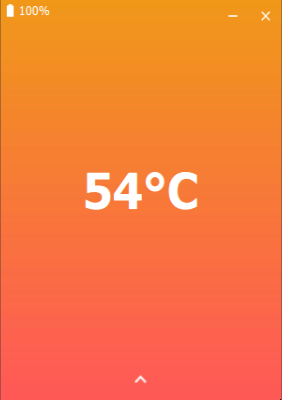
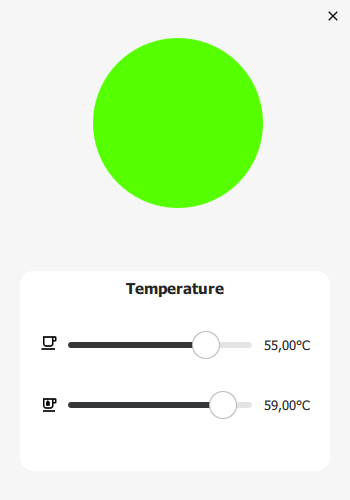

# EmberControl
Small python program to communicate with the Ember Mug. 

## Features

- [x] Connect to the Ember Mug
- [x] Show current temperature
- [x] Show current battery
- [x] Set target temperature tea (59°C)
- [x] Set target temperature coffee (55°C)
- [X] Three Temperature Animations
- [x] Implement User Settings

## Installation

Tested on Windows 10 with Python 3.7
Currently we are using the following [dependencies](requirements.txt): 

    qasync==0.13.0
    bleak==0.10.0
    PySide2==5.15.2
    
Install dependencies:

    pip install -r requirements.txt

Run the UI with: 

    python main.py

## Settings
Current Settings: 
- [x] LED Color 
- [x] Tea Temperature
- [x] Coffee Temperature
- [ ] Custom Preset
- [ ] Temperature Unit

    

